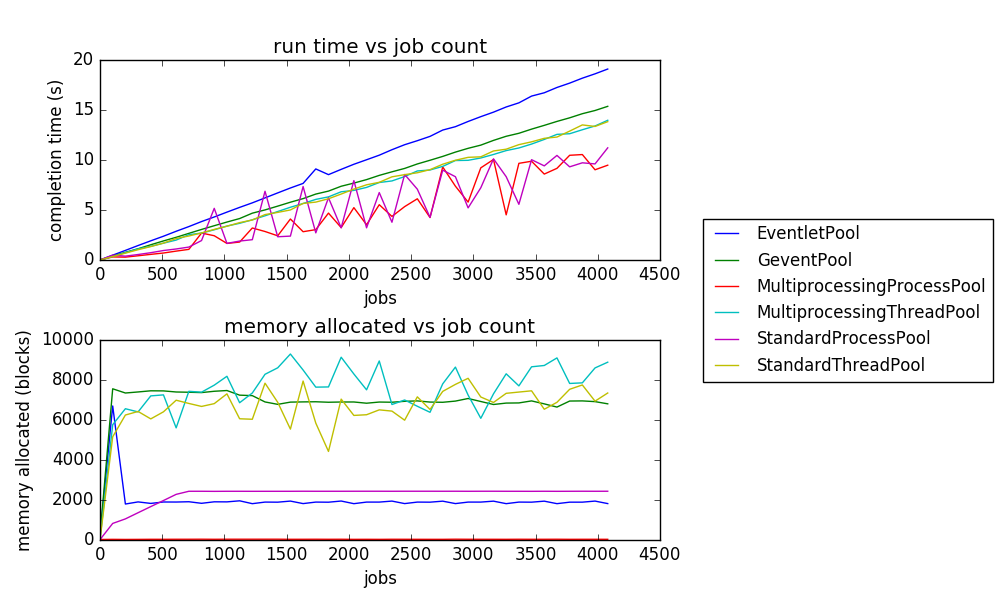

# Performance Analysis of Python Pools

## Goal

Analyze time and space usage of multiple Python thread and process pools with increasing job pool sizes.

Pools being tested:

* multiprocessing.pool.ThreadPool
* multiprocessing.pool.Pool
* concurrent.futures.ThreadPoolExecutor
* eventlet.GreenPool
* gevent.pool.Pool

Types of tests:

* io-bound tests will run the following on every job:
```python
import requests

def do_network_work(num: float):
    with requests.Session() as s:
        adapter = requests.adapters.HTTPAdapter(max_retries=3)
        s.mount('http://', adapter)
        s.get('http://localhost:8080/')
```
* cpu-bound tests will run the following on every job:
```python
from cmath import sqrt

def do_compute_work(num: float):
    return sqrt(sqrt(sqrt(num)))
```

## Methodology

Each thread pool is created with 50 threads and the `multiprocessing.pool.Pool` pool is created with `2 * multiprocessing.cpu_count() + 1` processes. The reason for this exception is because process performance wanes if there are many more processes than processing cores. Threads should behave the same way with _almost_ no regard to their quantity.

We will call an individual runner in the pools "executors". Executors will run one unit of work at a time. Increasing numbers of tasks will be submitted to each pool and the amount of time and space in memory will be recorded. The analysis comes in when seeing how well the pools handle running these tasks and how well they can clean up after finishing some tasks.

## Running your own tests

To run your own tests, simply install the requirements with `pip3 install -r requirements.txt` and then run `python3 pools.py --help` to figure out which arguments you would like to specify. In order to run the network tests you must start a decently performant web server locally. The web server I used is included in this repo. To run it, just run `python3 server.py`.

Be aware that the last step in the test runner is displaying a graph using matplotlib. Their documentation states that graphs do not work very well in virtual environments, so if you run into this issue you can disable the graph with `--no-graph`.

Note: pools.py is written for Python3 to make use of the built-in libraries of futures and multiprocessing as well as the lazily evaluated map functions. It cannot be run with Python2.

## Results

Note: The negative memory values shown in the memory allocated graphs are not actually negative memory. Those graphs show memory block allocation changes over time. If the graph trends below 0 allocated blocks, then this means that pool implementation freed more memory than it allocated during that time via garbage collection.

### CPU-bound tests

[Small test](data_dumps/small_compute_bound.md)


[Large test](data_dumps/large_compute_bound.md)


### IO-bound tests

[Small test](data_dumps/small_network_bound.md)


[Large test](data_dumps/large_network_bound.md)



## Conclusions

Out of the four kinds of tests run there do not seem to be any definitive winning pools, but there is one obvious losing pool.

Each pool has a particular function that was performance tested, the IO-bound performance, and the CPU-bound performance. The performance ratings are out of 5 for average performance relative to one another across all tests, higher is better. These ratings are very general and should not be considered performance metrics, merely a quick and potentially opinionated judgement to compare the pools.

### Overall Ranks

The multiprocessing process pool performed the best in larger batches of jobs but had performance issues with the initial space and time required. After certain points (point varies based on the bound type), the process pool always pulled ahead in time and sometimes in memory eventually.

To mitigate those initial space and time issues, the next best option is gevent's thread pool. The gevent pool consistently has the smallest memory footprint and has a pretty great running speed.

Eventlet's thread pool sits right next to gevent in terms of performance, normally. It has a slightly higher memory footprint, but other than that the two pools are nearly identical under these performance tests.

For the absolute fastest pool implementation, the multiprocessing thread pool is the best bet. Although this pool's memory gets a little out of control at times, it still manages to not grow too quickly with increasing numbers of jobs.

There is one clear pool to avoid and that is the ThreadPoolExecutor. Its memory footprint grows at a ridiculous rate relative to these other pools. It does not seem to clean up very much memory at all. Additionally, the run times increase greatly with larger batches of compute jobs, far more than the other pools do.

* Overall
    - `multiprocessing.pool.Pool`: 4.125/5
    - `gevent.pool.Pool`: 3.625/5
    - `eventlet.GreenPool`: 3.5/5
    - `multiprocessing.pool.ThreadPool`: 3.375/5
    - `concurrent.futures.ThreadPoolExecutor`: 1.75/5
* IO-bound tasks
    - `multiprocessing.pool.Pool`: 4/5
    - `multiprocessing.pool.ThreadPool`: 3.75/5
    - `gevent.pool.Pool`: 3.5/5
    - `eventlet.GreenPool`: 3/5
    - `concurrent.futures.ThreadPoolExecutor`: 1.75/5
* CPU-bound tasks
    - `eventlet.GreenPool`: 4/5
    - `gevent.pool.Pool`: 3.75/5
    - `multiprocessing.pool.Pool`: 3.25/5
    - `multiprocessing.pool.ThreadPool`: 3/5
    - `concurrent.futures.ThreadPoolExecutor`: 1.75/5

### Eventlet Green Pool

* Pool type: thread pool
* Function: `eventlet.GreenPool.imap`
* IO-bound time: 2/5
* IO-bound space: 4/5
* CPU-bound time: 3/5
* CPU-bound space: 5/5

### Gevent Pool

* Pool type: thread pool
* Function: `gevent.pool.Pool.map`
* IO-bound time: 2/5
* IO-bound space: 5/5
* CPU-bound time: 2.5/5
* CPU-bound space: 5/5

### Multiprocessing Process Pool

* Pool type: process pool
* Function: `multiprocessing.pool.Pool.map`
* IO-bound time: 4/5
* IO-bound space: 4/5
* CPU-bound time: 2.5/5
* CPU-bound space: 4/5

### Multiprocessing Thread Pool

* Pool type: thread pool
* Function: `multiprocessing.pool.ThreadPool.map`
* IO-bound time: 4/5
* IO-bound space: 3.5/5
* CPU-bound time: 5/5
* CPU-bound space: 1/5

### Thread Pool Executor

* Pool type: thread pool
* Function: `concurrent.futures.ThreadPoolExecutor.map`
* IO-bound time: 2.5/5
* IO-bound space: 1/5
* CPU-bound time: 1.5/5
* CPU-bound space: 2/5
